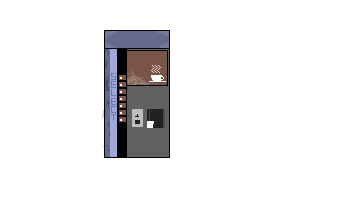

# multimedia-social-distancing start document

# Contents
 - Chapter 1: Team Composition and division of tasks.
    - Code of conduct
 - Chapter 2: Choice of subject, Target group, purpose of project
    - Choice of subject 
    - Target audience
    - Purpose of the product
 - Chapter 3: Substantive preliminary research 
 - Chapter 4: Concept Development
 - Chapter 5: Initial Visualizations
 - Chapter 6: planning production

## Chapter 1: Team composition and division of tasks.

 Team Multimedia production is compromised out of 6 members which are the following: 
 
|Name   |Email     |
|-------|:--------:|
|Robin Michael Visser|robin.michael.visser@student.nhlstenden.com|
|Chris Takács|chris.takacs@student.nhlstenden.com|
|Pepe Loperena Monzon|pepe.loperena@student.nhlstenden.com|
|Artem Yerzakovich|artem.yerzakovich@student.nhlstenden.com|
|Marek Stryjeński|marek.stryjenski@student.nhlstenden.com|
|Steffen Tourbier |steffen.tourbier@student.nhlstenden.com|

The tasks required to develop the project are divided as shown in the table below:

|Name   |Task     |
|-------|:--------:|
|Chris Takács – Back-end developer|Programming in JavaScript/ActionScript|
|Steffen Tourbier - Back-end developer|Back-end developer programming in JavaScript/ActionScript
|Robin Michael Visser – Front-end developer |Designing graphics(Character design)|
|Pepe Loperena Monzon - Front-end developer | Designing the Graphical User Interface|
|Artem Yerzakovich – Front-end developer |Designing character and environment animations|
|Marek Stryjeński - Front-end developer|Designing environments and making animations|

## Code of conduct. 

**Work methods**
1. Project members must be present at the agreed times and at the agreed location.
   - a. In case of a valid reason, absence will be tolerated. This includes incidental events (e.g.:
   illness, death, accidents, transport) and planned events (e.g.: wedding, funeral, doctor's
   visit). In this case, absence must be reported no later than one day in advance.
   - b. If the project member does not have a valid reason to be absent, the project member
   will receive a warning which will be recorded in the shared warnings file.
     
2. Project members must report incidental absence at least half an hour before the start of the
   appointment.
   - a. You will have to inform the group in the created WhatsApp group or telephone the current
   team leader.
   - b. If the project member does not report this in time, they will receive a warning. (see point
   1b)
   - c. In case of an invalid reason of absence, the project member also receives a warning (see
   point 1b)
     
3. Each project member must be present on time in the scheduled places.
   - a. Reporting in case of late attendance via WhatsApp or calling.
   - b. There is a 5-minute leeway for lateness.
   - c. If a member is more than 5 minutes late and has not informed the group, they will receive a
   warning.
     
4. Every project member must be easily contactable.
   - a. Project members have each other's phone number and e-mail addresses and can thus
   reach each other.
   - b. If a member is not contactable, there must be a valid reason with proof, e.g., power outage,
   work, illness, family matters. Should this be called upon, the project manager may ask to see
   proof e.g., doctor’s letter, work schedule.
     
5. Every project member must comply with the agreements made.
   - a. If the project member does not have a valid reason not to comply with the agreements, the
   project member will receive a warning (see point 1b
   - b. If a deadline is not reached, this must be indicated in time - 48 hours before.
   the deadline. In consultation with the group, it can be decided to postpone the deadline.
   - c. In a case where the project member is totally unable (serious illness etc.) to fulfill the
   agreement, the other members must take over the work to the best of their ability.
     
6. Each project member must do a proportionate part of the work. Cavalier behavior will not be
   tolerated.
   - a. In a case where the project member is totally unable (serious learning disabilities,
   serious illness etc.) to perform the work, the other members must take over the work
   to the best of their ability.
   - b. In the case of unacceptable behavior, a conversation will be entered into with the
   project leader / coordinator, and the project member in question. If no progress is made
   after this conversation, a warning will be issued each time the project member is
   approached.
     
7. Project members must complete the assigned tasks and agreements at the agreed upon time.
   These will be recorded in the minutes of the meetings.
   - a. In case of failure, the relevant project member will receive a warning.
   - b. If the assigned task and/or appointment is disproportionate for the allocated time, this
   must be discussed in time within the group.
     
8. Project members must actively participate in the group hours, meetings, and lessons.
   - a. In case of repeated absence of active participation, the project member receives a warning.
   - b. This considers differences in personalities and skills.
   - c. Only the minutes secretary and the chairman may have a laptop open during client
   meetings.
   - d. No telephones may be used during client meetings.
    
9. Project members have to speak to each other about meeting appointments.
   
10. Pauses are joint and in consultation with the group.4
    - a. When planning breaks, it is considered that a project member may work for up to three
    hours in a row.
      
    **Behavior**
1. Every project member must contribute to a good working atmosphere.
   - a. Repeated failure of this will result in a warning.
    
2. Every project member is expected to show respect for the ideas of other project members.
   - a. For the progress and the prosperity of the project, it is important that you hear and
   examine as many ideas as possible.
   - b. Repeated failure of this will result in a warning.
    
3. Every project member must have respect in the input and opinion of others.
   - a. It is important for the progress and prosperity of the project that people hear and
   examine as much input and opinions as possible. This will benefit the project.
   - b. Repeated failure of this will result in a warning.
    
4. Every project member must be loyal to the group.
   - a. For the progress and prosperity of the project, it is important to be honest with the group
   and to comply with the agreements.
   - b. Repeated failure of this will result in a warning. One can think of evading group discussions
   and meetings.
     
5. Every project member should contribute as much as possible to solving problems.
   - a. This is very important for our study progress and the progress of the project.
   - b. Deliberate repeated failure of this will result in a warning.
   
   **Respect**
1. Everyone must consider the interests of other project members.
   - a. Consider the needs and requirements of the project members.
   - b. In case of repeated failure this will result in a warning.
    
2. Everyone must consider differences.
   - a. Each project member has a different background. This may cause differences. This may
   include other behaviors, eating patterns, religions, religious customs, and many other
   behaviors.5
     
3. Everyone must consider the difference in working methods.
   - a. Every person has a different way of working. You have to take this into account. There
   are, after all, different ways to achieve a goal.
   - b. If the method does not lead to the desired result, this problem should be discussed in
   the group hours / meetings.
   - c. If there is no respect for differences in working methods, the person who does not show
   respect will receive a warning.
     
4. There should be no exclusion or other bullying behavior between project members.
   - a. It is not appropriate to exclude or bully other project members.
   - b. If someone is excluded / bullied, this should be discussed with the consent of the victim
   in the group hours / meetings.
   - c. The perpetrator (s) receive a warning if this behavior takes place.
    
5. There should be no intimidation or discrimination between project members.
   - a. Intimidation or discrimination is not appropriate.
   - b. If there is a conscious discrimination or harassment of project members to harm him
   or her, the perpetrator will immediately receive a warning.
     
6. Project members should consider project members who are ill.
   - a. Project members should help and assist sick project members if needed.
   - b. If the project member is ill and is unable to complete his work on time, this work must
   be taken care of by the other project members.
   - c. A deliberate omission will result in a warning. This applies for both point and b.
    
7. Project members should consider personal circumstances of other project members.
   - a. Project members should assist project members with problems if necessary.
   - b. If the project member is unable to complete his work on time, this work must be taken care
   of by the other project members.
   - c. A deliberate omission will result in a warning. This applies for both point and b.
   
   **Warnings**
   - 1. In case of violation of one of the above points, the project member receives a warning
   from the project manager. (With the group)
   - 2. The project manager keeps the warnings in a general Excel file on the 'Google Drive'.
   - 3. Each warning is discussed in the group.
   - 4. If the person in question receives a third warning, their respective study career coach
   will be contacted.

# Chapter 2: Choice of subject, target group, purpose of the product

###**Choice of subject**
The subject of our application is social distancing. We have chosen this subject because as we all know,
Covid-19 is currently extremely relevant. As it is a hot topic, we have decided to use it in our favour
and create an application about it. We try to shine more light onto social distancing, and the importance
of it as it is one of the necessary things to do to stop Covid-19. However, many people do not keep the
needed distance. This subject is represented in our application as the main goal of it is to make sure
the player follows the 1.5 metre rule, even as no one else does. Social distancing is clear all around the
application as it is our focus on the game to follow social distancing rules.

###**Target audience**
Our target audience are mainly university students. Mainly, University students from NHL Stenden
Emmen. This is our target audience as the theme of the game is situated In the NHL Stenden university
campus. People from outside the target audience that do not attend the NHL Stenden university will
still enjoy playing our game as still it talks about social distancing which is something that everyone
still knows about but will not understand the references the game makes to for example the teachers
or locations. Additionally, teenagers and young adults are according to research the age groups that
social distance themselves the least.

###**Purpose of the product**
The purpose of our product is to entertain and educate young students and adults about social
distancing but in an entertainment way. Our application will reach this purpose due to the fact that
everything about the game is about social distancing and how to prevent the virus even more, for
example by making items in the game like masks that will increase your defence and hand sanitizer
that restores health. The game is also supposed to bring entertainment by providing a fun and simple
game

# Chapter 3: Substantive preliminary research
###***What language?***
The best programming language for this project is ActionScript, since the group has chosen to do their
game on a HTML5 platform. Furthermore, the members of the group who are responsible for coding
the game already have experience with this coding language so that will positively affect the final
outcome.

###***Soundtrack for the game***
One of the group members has asked his colleague if he would be interested in creating a theme
song for our game, and he agreed. Other required sound effects such as a sound of character moving,
etc., will be downloaded from free open-source website Free Sound.
###***What software for the animations?***
To complete this project, the group will use Adobe animate for animations. Adobe animate supports
vector, but most important bitmap images which will be really useful since the game will be done in
pixels. In addition, it offers the ability to hand draw frame by frame animation where individual layers
can easily be swapped.
###***The team made use of the following media:***
- Crockford, D. (2008). JavaScript: The good parts: The good parts " O'Reilly Media, Inc.".
- Labrecque, J., & Schwartz, R. (2016). Learn adobe animate CC for interactive media: Adobe certified
associate exam preparation Peachpit Press.
- Enigmatic_e.(2019,May 8).How To Animate Pixel Art Dialogue[Video file].Retrieved from
https://youtu.be/e1kH1QVN6lw
- Brandon James Greer. Videos[YouTube channel]. Retrieved from
https://youtube.com/channel/UCC26K7LTSrJK0BPAUyyvtQg
- Jong-Yoon Kim. Videos[YouTube channel]. Retrieved from
https://www.youtube.com/channel/UCr7dEeZdIEFy7jtO51uENZ

#Chapter 4: Concept development
Social Distancing Simulator 2020 is a 2D pixel art game in which the player is the only student trying to
keep social distancing. You will walk through the school of NHL Stenden trying to go to class when
other students try to break the 1.5 metres distance rule. The main objective is to keep appropriate
distance and safely make it to the class.
###
The thought behind the game is to make people aware of the importance of social distancing. This is
done by explaining the dangers and making people aware in a playful and entertaining way.
The game will consist of a single level, and it starts in your first day at NHL Stenden. The player will enter
the school at the main entrance, the rotating door right in front of the reception. René Laan will explain
to the user that there is a 1.5 metre rule distancing within the university and that the player will have
to avoid the careless people running around. He then will explain how to move around and use the
map.
###
The goal of Social Distancing simulator 2020 is based on the classes that are in the days schedule. There
will also be arrows on the floor, just like the actual university, showing which direction the player must
follow. When the user arrives at the class, the game has been won.
When the player arrives at the destination, a victory screen will pop up. This means that the player has
won the game.
###
When the player loses the game by getting too close to other students, a losing screen will show, and
the player will spawn at the beginning of the stage.
###
The design is made to be simple and clear. This way the focus will be on the message.
###
The sound will consist of music and sound effects. The sound effects will be footsteps, for when your
character is walking around, and a sound for when you come too close to another student.
###
The music in the game will consist of four tracks: one on the start screen, one while playing the game,
which gets faster as students get closer to the player, and a song for both the victory and losing screen.
This music will be custom-made for Social Distancing Simulator 2020 by Anthony Roessler.

#Chapter 5: initial visualizations

This chapter focuses on the visual design of the project. It underlines the description of the design as
well as includes the graphics of the game.
###
The art of the game is made in the style of the so-called ‘pixel art’. This means that assets are created
on a pixel level. Because of this, the entire game will have a retro 16-bit video game feeling.
All characters are 14x21 pixels on front and back, and 11x21 pixels on the side. The background which
serves as the map of the game is 200x350 pixels.
###
The character designs are based on the team Multimedia Dungeon and on the teachers at NHL
Stenden, as a fun Easter egg for the students that attend this university. The assets and locations are
also based on reality, however not exactly true to life. In the figure below, the assets are shown, as
well as the base every single one of these assets was created on.

*Figure 1: Character assets and a character model*
###

These sketches are only the initial visualizations
of the game. It is highly likely that these assets
will be changed. The map, as seen on the side,
is the very first edition. Additionally, a whole set
of concept arts are being developed. These
assets include the following:
- Main menu screen
- Map of the downstairs area
- Map of the upstairs area
- Anthony, the producer for the music
- Rene Laan
- Vending machine
- Rotating door at the entrance
- Hp loss sign
- Exclamation mark for when the player is
attacked
- Victory / game over screen
- Health bar for the player

#Chapter 6: Planning production

In this Chapter, the timetable breaking down the production plan is displayed. Each week will be
described individually, with a recap in the form of a table at the end of the chapter.
Due to complications, the production of this application has changed. All the assets were done prior
to the development of the application. Although the final presentation and final application testing
was done during MMP week.
###
This part of the Start document, explains the development of the application prior to the complications
on the 1st period of this academic year.
###
The First week of production (Week 5), will be used to complete the start document to bring the team
on the same track regarding development, as well as for finalizing the designs of the characters to be
implemented in the final product. This includes miscellaneous characters found throughout the game,
creator characters, and guest characters.
###
The Second week of production (Week 6) will be where the main non-character assets will be
produced. The main maps will be produced, along with the other assets such as couches, tables, and
other miscellaneous objects. Also, in this week, the main sound effects will be completed, including
the main background track, and other miscellaneous sounds that will be a part of the game.
###
The Third week of production (Week 7) is where the main development of the game will be. In this
week, the maps will be made interactive, and the game will be made so that it is in a playable state.
Because this week is prefaced by the autumn break, development will be done in this period to set in
place the foundations needed for successful development in week 7.
###
The last two weeks of production (Week 8 and 9) will be spent adding additional assets to the game,
including potential items, buffs, and characters. Since most of the production will have been completed
by this time, only minor changes will be made, and the game will be in a presentable state

